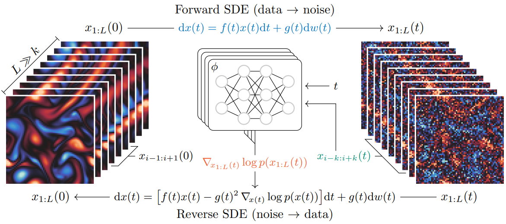
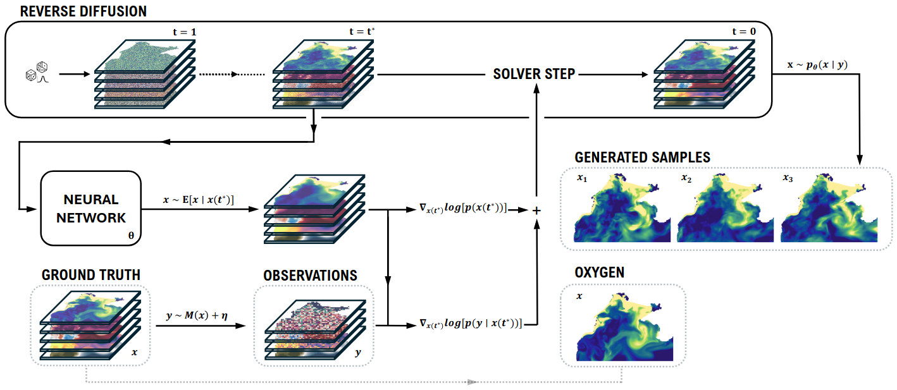
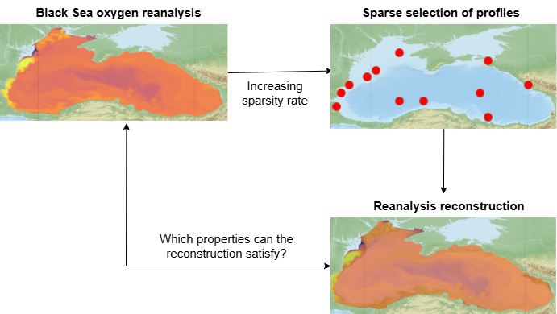
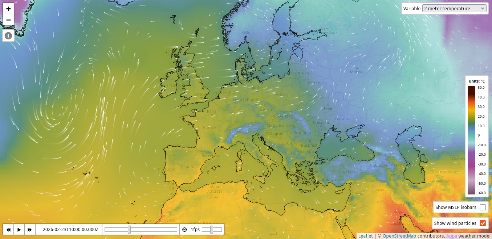
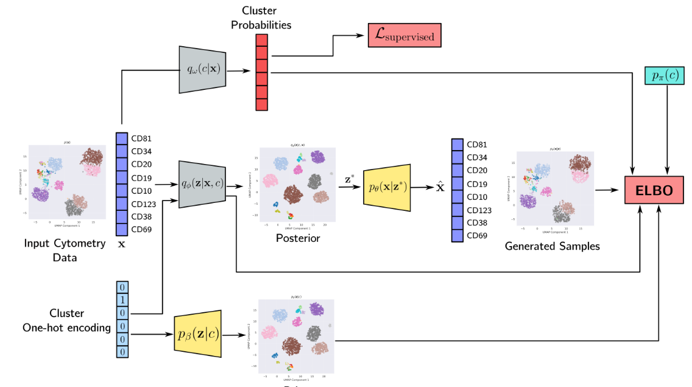
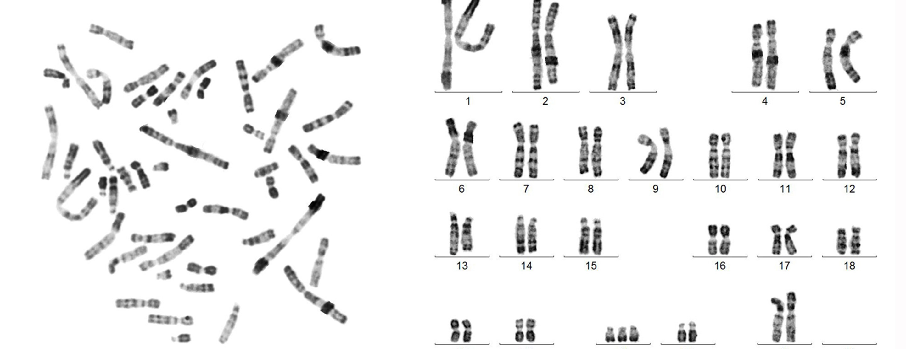
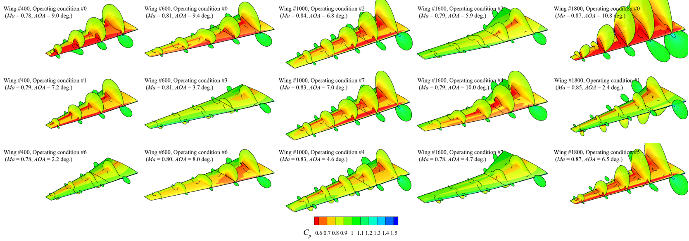

MSc thesis topics for 2026-2027 are proposed below. The topics are generally available for students with a background in deep learning, regardless of their specific field of study. The list is non-exhaustive, feel free to come and discuss with me.

## ① Scaling latent diffusion models for weather forecasting

Recent work has shown that simple, scalable latent diffusion frameworks can achieve state-of-the-art probabilistic weather forecasting without the need for domain-specific architectural constraints or specialized training recipes. In particular, the ATLAS framework ([Kossaifi et al., 2026](https://arxiv.org/abs/2601.18111)) demonstrates that a standard transformer operating in a compressed latent space, combined with a history-conditioned local projector, can outperform both the IFS ensemble and GenCast across most variables.

In this project, we will study the lessons from ATLAS and related work to inform the design of a next version of Appa, our 1.5B-parameter latent diffusion model for global weather modeling. This includes investigating the impact of latent space design choices (direct downsampling vs. variational encoding), backbone architecture (transformer vs. U-Net), probabilistic estimator (diffusion, stochastic interpolants, CRPS-based training), and conditioning strategies on forecast skill and computational efficiency.

    
**References:**
- Kossaifi et al., 2026, [ATLAS: A Scalable Framework for Probabilistic Weather Forecasting](https://arxiv.org/abs/2601.18111)
- Rozet et al., 2025, [Lost in Latent Space: An Empirical Study of Latent Diffusion Models for Physics Emulation](https://arxiv.org/abs/2507.02608)
- Andry et al., 2025, [Appa: Bending Weather Dynamics with Latent Diffusion Models for Global Data Assimilation](https://appa.montefiore.uliege.be)
- Price et al., 2023, [GenCast: Diffusion-based ensemble forecasting for medium-range weather](https://arxiv.org/abs/2312.15796)

Contact: [Gilles Louppe](mailto:g.louppe@uliege.be), [Gérôme Andry](mailto:gandry@uliege.be).

## ② Generative models of sequences of arbitrary lengths

Score-based data assimilation (SDA) enables non-autoregressive generation of state trajectories by decomposing the score of long sequences into scores over short overlapping segments, using a Markov blanket mechanism. While effective, recent findings in our group indicate that information propagates very slowly across blanket boundaries during the denoising process, limiting the model's ability to capture long-range temporal dependencies and to generalize to sequences of arbitrary lengths.

In this project, we will investigate alternative generative modeling approaches that can natively handle sequences of variable and arbitrary lengths. This includes exploring architectural designs (e.g., continuous-time models, flexible attention mechanisms, or recurrent diffusion schemes) that avoid fixed-length decompositions, and evaluating their impact on trajectory quality and coherence. The project will build on the SDA framework ([Rozet & Louppe, 2023](https://arxiv.org/abs/2306.10574)) and related work on conditional diffusion models for PDE simulations ([Shysheya et al., 2024](https://proceedings.neurips.cc/paper_files/paper/2024/hash/2974844555dc383ea16c5f35833c7a57-Abstract-Conference.html)), and evaluate improvements in the context of weather data assimilation.

**References:**
- Rozet & Louppe, 2023, [Score-based Data Assimilation](https://arxiv.org/abs/2306.10574)
- Shysheya et al., 2024, [Conditional Diffusion Models for PDE Simulations](https://proceedings.neurips.cc/paper_files/paper/2024/hash/2974844555dc383ea16c5f35833c7a57-Abstract-Conference.html)
- Morel et al, 2025, [Predicting partially observable dynamical systems via diffusion models with a multiscale inference scheme](https://arxiv.org/pdf/2511.19390)

Contact: [Gilles Louppe](mailto:g.louppe@uliege.be), [Gérôme Andry](mailto:gandry@uliege.be).

## ③ Latent diffusion models for ocean emulation

Numerical ocean models simulate complex biogeochemical and physical processes but are computationally expensive. In our group, we have been developing deep learning emulators for the Black Sea based on diffusion models operating directly in pixel space, with promising initial results.

In this project, we will explore whether latent diffusion models (LDMs) can improve upon this approach. By first learning a compressed latent representation of the ocean state through an autoencoder, and then training a diffusion model in this latent space, we expect to achieve higher quality emulations at reduced computational cost. The project will involve designing and training the autoencoder and latent diffusion components, and comparing the results against our existing pixel-space diffusion baseline.

**References:**
- Rozet et al., 2025, [Lost in Latent Space: An Empirical Study of Latent Diffusion Models for Physics Emulation](https://arxiv.org/abs/2507.02608)

Contact: [Gilles Louppe](mailto:g.louppe@uliege.be), [Victor Mangeleer](mailto:vmangeleer@uliege.be), [Marilaure Grégoire](mailto:mgregoire@uliege.be).

## ④ Quantifying Information Requirements for Biogeochemical Field Reconstruction in the Black Sea

Measurements along the water column are one one of our main source of observations for the
biogeochemistry of the ocean. However, sensors and ship campaigns through which these data
are collected are expensive, causing the ocean observations to be very sparse in time and space.
Machine learning methods can help reconstruct ocean fields from incomplete measurements, 
but their performance strongly depends on the amount and distribution of available information.
The goal of the thesis is to study how the reconstruction error increases when the available information
decreases both in time and in space, and what is the minimal amount of information that allow to 
preserve some desired properties (e.g. seasonal mean and variability in coastal and open sea areas). 
In particular, we plan to start from a biogeochemical reanalysis of a regional sea (the Black Sea), 
which we will consider as our ground truth. Sparse observational scenarios will be simulated by 
subsampling the reanalysis in space and time, and we will use data-driven methods to recover the full
fields from these sparse observations.
The motivation of this work is two folds: on the one hand, knowing when and where data should be 
collected in order for some properties to be preserved may give indications to minimize the effort 
in expensive ship camapaigns; on the other hand, given a set of data that has already been collected, 
we can estimate how accurately we are able to reconstruct biogeochemical fields and how much the 
properties of our interest are preserved.

**References:**
- Garcia-Espriu et al., 2025, [On the global reconstruction of ocean interior variables: a feasibility data-driven study with simulated surface and water column observations](https://doi.org/10.5194/os-21-2579-2025)
- Nagata et al., 2021, [Data-driven sparse sensor selection based on A-optimal design of experiment with ADMM](https://doi.org/10.1109/JSEN.2021.3073978)

Contact: [Gilles Louppe](mailto:g.louppe@uliege.be), [Federica Adobbati](mailto:fadobbati@uliege.be), [Marilaure Grégoire](mailto:mgregoire@uliege.be).

## ⑤ Web demonstrators and MLOps for large weather models

Our research group develops large weather models, including [Appa](https://appa.montefiore.uliege.be) for global weather modeling and MAR.ai for regional climate modeling over Belgium. These models produce massive amounts of high-dimensional spatio-temporal data (global fields at 0.25° resolution, hourly time steps, multiple atmospheric variables and pressure levels) that need to be served efficiently and visualized interactively. Bridging the gap between research prototypes and production-grade deployment is a substantial engineering challenge that involves distributed inference, data pipelines at scale, and real-time web visualization of geospatial data.

In this project, we will design and build the full deployment and visualization stack for these models. On the MLOps side, this includes model serving infrastructure, automated inference scheduling, data processing pipelines, and monitoring. On the frontend side, this includes building interactive web demonstrators capable of rendering large weather fields in real time, with features such as ensemble uncertainty visualization, point forecasts, and comparison against observations. The project will require tackling challenges in efficient data tiling and streaming, GPU-accelerated rendering, and scalable backend architecture. The exact scope will be defined depending on the student's interests and skills.

**References:**
- Andry et al., 2025, [Appa: Bending Weather Dynamics with Latent Diffusion Models for Global Data Assimilation](https://appa.montefiore.uliege.be)

Contact: [Gilles Louppe](mailto:g.louppe@uliege.be).

## ⑥ Deep Sets for classification of flow cytometry data

Multi-parametric flow cytometry (MFC) is a laboratory technique used to analyze the physical and chemical features of cells by passing them through a laser beam and measuring the emitted fluorescent signals. It is widely used in clinical and research settings to study the immune system, cancer, and other diseases. Recent work in our group (MARVIN) has explored deep learning approaches for analyzing and representing flow cytometry data.

In this project, we will extend this line of work by exploring Deep Sets and related permutation-invariant architectures for the classification of flow cytometry samples. Key applications include the detection of minimal residual disease (MRD), where the goal is to identify rare residual cancer cells in patient samples after treatment, automated diagnosis from cytometry panels, and survival prediction. The project will involve designing and evaluating set-based neural network architectures that can operate directly on variable-size collections of cells and learn sample-level representations for clinical decision-making.

**References:**
- Zaheer et al., 2017, [Deep Sets](https://arxiv.org/abs/1703.06114)
- Lee et al., 2019, [Set Transformer: A Framework for Attention-based Permutation-Invariant Neural Networks](https://arxiv.org/abs/1810.00825)

Contact: [Gilles Louppe](mailto:g.louppe@uliege.be), [Adrien De Voeght](mailto:adrien.devoeght@chuliege.be).

## ⑦ Automated karyotyping with deep learning

Karyotyping is the process of analyzing an individual's chromosomes from microscopy images. It involves segmenting, classifying, and pairing chromosomes to produce the chromosome formula (karyotype), which is essential for diagnosing genetic disorders such as trisomies, translocations, and other chromosomal abnormalities. Currently, this process is largely manual and time-consuming for cytogeneticists.

In this project, we will develop a deep learning pipeline for automated karyotyping. The pipeline will combine instance segmentation to detect and isolate individual chromosomes from metaphase spread images, followed by classification to identify each chromosome by type and produce the final karyotype formula. The project will explore modern computer vision architectures and evaluate their performance on clinical cytogenetic data.

Contact: [Gilles Louppe](mailto:g.louppe@uliege.be), [Adrien De Voeght](mailto:adrien.devoeght@chuliege.be).

## ⑧ Towards Data-Efficient Machine Learning for Aerodynamic Modeling via Transfer Learning

The objective of this work is to investigate strategies for reducing the amount of data required to train accurate deep
learning models for aerodynamic prediction. Building on existing databases, models, and simulation workflows, the
project aims to bridge the gap between traditional design-of-experiments datasets and modern foundation-model
approaches in scientific machine learning (SciML) by leveraging transfer learning methods.

This MSc thesis project is proposed in collaboration with [Cenaero](https://www.cenaero.be/), a leading research center in aerodynamics and computational fluid dynamics (CFD). The supervision will be shared between Joachim Dominique (Cenaero) and Gilles Louppe (ULiège). 

**References:**
- Full offer from Cenaero [PDF](../assets/msc-thesis/msc-2026-cenaero.pdf)
- Yang et al., 2024, [SuperWing: a comprehensive transonic wing dataset for data-driven aerodynamic design](https://arxiv.org/abs/2512.14397)

Contact: [Gilles Louppe](mailto:g.louppe@uliege.be), [Joachim Dominique](mailto:joachim.dominique@cenaero.be) (Cenaero).

## ⑨ Monitoring and analyzing the energy consumption of a GPU cluster

Our research group operates Alan, a GPU cluster with 15 compute nodes and approximately 95 GPUs, used for training and running deep learning models. As AI workloads grow in scale, understanding and optimizing the energy footprint of such infrastructure becomes increasingly important, both for sustainability and for cost management.

In this project, we will design and implement a monitoring system to measure and record the electrical consumption of the cluster at multiple levels (per-GPU, per-node, per-job). Building on this data, we will analyze consumption patterns across different workloads (training, inference, idle), identify inefficiencies, and explore strategies to reduce energy usage without impacting research productivity. The project will also include a literature review on the energy consumption of AI infrastructure, and a cross-analysis comparing our measurements with figures reported by other institutions and in the scientific literature. Finally, it may involve developing dashboards for real-time monitoring and benchmarking the energy cost of specific models and training runs.

**References:**
- Luccioni et al., 2024, [Power Hungry Processing: Watts Driving the Cost of AI Deployment?](https://arxiv.org/abs/2311.16863)
- Patterson et al., 2021, [Carbon Emissions and Large Neural Network Training](https://arxiv.org/abs/2104.10350)
- CodeCarbon, [Track and reduce CO2 emissions from compute](https://codecarbon.io/)

Contact: [Gilles Louppe](mailto:g.louppe@uliege.be).

---

Previously supervised MSc thesis (2018-Present) can be found on [Matheo](https://matheo.uliege.be/simple-search?query=advisor%3Ap015640&location=&sort_by=dc.date.issued_dt&order=desc).

