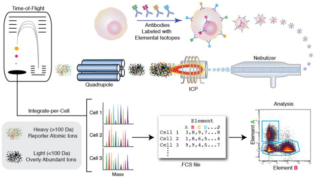
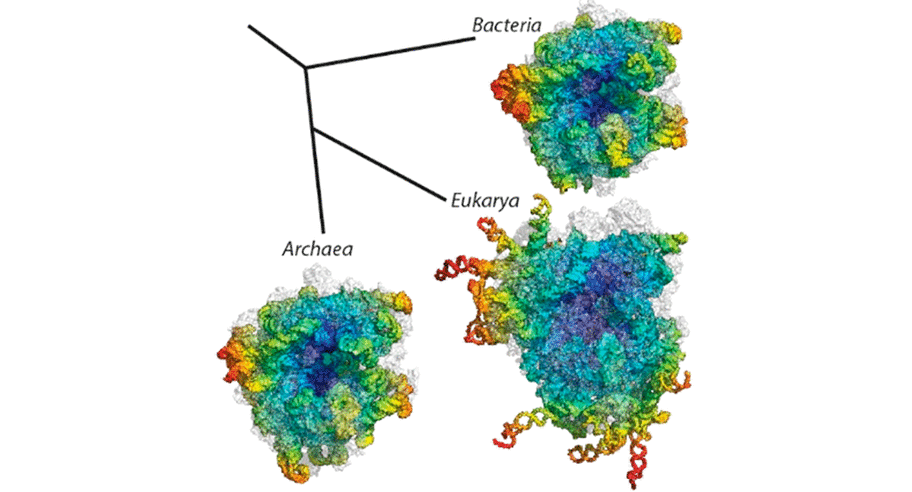

A list of MSc thesis topics for 2025-2026 is proposed below. The topics are generally available for students with a background in deep learning, regardless of their specific field of study. The list is non-exhaustive, feel free to come and discuss with me.

## AI for Science

Our research group focuses its efforts around the development and application of deep learning methods for scientific applications. MSc thesis topics are available in the following areas:

- Deep generative models for scientific data
- Inverse problems and simulation-based inference
- Deep learning for weather and climate science (emulation, data assimilation, forecasting, downscaling, etc.)
- Deep learning for oceanography 

Specific topics should be discussed depending on the student's interests and background. 

Contact: [Gilles Louppe](mailto:g.louppe@uliege.be)

## Appa: a latent diffusion model for global weather modeling

Appa is a 1.5B-parameter large weather model developed by our research group for global weather modeling. It builds on score-based data assimilation and latent diffusion models to produce global atmospheric trajectories at 0.25-degree resolution and 1-hour intervals. Several MSc thesis topics are available around Appa, including (one or several of the following):
- Exploring and improving its autoencoder architecture
- Exploring and improving its diffusion model architecture
- Fine-tuning on real-world data
- Assessing its physical consistency

Contact: [Gilles Louppe](mailto:g.louppe@uliege.be)

## Flow cytometry data analysis with deep learning

Multi-parametric flow cytometry (MFC) is a laboratory technique used to analyze the physical and chemical features of cells. More specifically, flow cytometry data is used to identify and characterize cell populations based on their surface markers and other properties. The analysis of flow cytometry data is complex and requires the use of advanced statistical and machine learning methods. It is widely used in clinical and research settings to study the immune system, cancer, and other diseases.

The first step in MFC consists in mixing cells from a biological sample (e.g., blood) with fluorescently labeled antibodies. The cells are then passed through a laser beam, and the emitted light is collected by detectors. The result is a high-dimensional dataset, where each cell is represented by a vector of measurements, corresponding to the intensity of the emitted light for each of the fluorescent markers. Technological advances have led to an increase in the number of markers that can be measured simultaneously (up to 40 or more) and in the number of cells that can be analyzed (up to millions). This has led to a need for new methods to analyze and interpret the data.

In this project, we will explore unsupervised deep learning approaches to analyze and cluster flow cytometry data. We will investigate deep generative models to learn the underlying structure of the data and to identify subpopulations of cells in control and disease samples, as well as their evolution over time.

Contact: [Gilles Louppe](mailto:g.louppe@uliege.be), [Adrien De Voeght](mailto:adrien.devoeght@chuliege.be), [Frédéric Baron](mailto:f.baron@uliege.be).

## Single-cell RNA data analysis with deep learning

Single-cell RNA sequencing (scRNA-seq) is a technology used to measure gene expression at the individual cell level, providing unprecedented resolution for understanding cellular heterogeneity and identifying rare cell populations. Unlike bulk sequencing, scRNA-seq reveals transcriptomic profiles of each cell, but presents significant computational challenges due to its high dimensionality, sparsity, technical noise, and batch effects that can confound biological signals.

In this project, we will explore deep learning approaches to analyze and interpret scRNA-seq data in the context of immunology and cancer research. We will focus on unsupervised representation learning using generative models  for dimensionality reduction, cell clustering, and trajectory inference. We will pay particular attention to developing and comparing methods for batch effect correction while preserving biological variation. The project will involve implementing state-of-the-art deep learning approaches and evaluating their performance on public and new scRNA-seq datasets.

Contact: [Gilles Louppe](mailto:g.louppe@uliege.be), [Adrien De Voeght](mailto:adrien.devoeght@chuliege.be), [Frédéric Baron](mailto:f.baron@uliege.be).

## Rewinding the prebiotic accretionary formation of ribosomes with diffusion models

Ribosomes are the molecular machines that translate messenger RNA (mRNA) into proteins. They are composed of ribosomal RNA (rRNA) and proteins, and their assembly is a complex process that involves the folding of rRNA and the binding of ribosomal proteins. The assembly of ribosomes is thought to have evolved from simpler structures in early life forms, but the details of this process are still poorly understood. In this project, we will use diffusion models to study the assembly of ribosomes from their constituent parts. [<a href="../assets/msc-thesis/msc-2025-ribosome.pdf">PDF</a>].

Contact: [Gilles Louppe](mailto:g.louppe@uliege.be), [André Renard](mailto:andrejrenard@gmail.com).

## Large language models at NRB

In collaboration with NRB, two master thesis topics are proposed on large language models (LLMs). 
- The first topic consists in assessing the robustness of LLMs to jailbreaking attacks. Jailbreaking is a technique used to bypass the restrictions of LLMs and to make them generate harmful or inappropriate content. The goal of this project is to develop and evaluate jailbreaking techniques for LLMs, and to develop countermeasures to mitigate these attacks. 
- The second topic consists in exploring how system prompts should be refined to guarantee constraints specific to the application domain. Multi-agent refinement strategies will be explored to ensure that the system prompts are aligned with the application domain and that the generated content is relevant and appropriate.

Contact: [Gilles Louppe](mailto:g.louppe@uliege.be), [Norman Marlier](mailto:Norman.MARLIER@nrb.be)

## Deep learning and Computer vision at EVS

In collaboration with EVS Broadcast Equipment, several master thesis topics are proposed on deep learning for sport videos. Topics include novel view synthesis, multi-modal models, or generative models, among others. The exhaustive list of projects is available in the document below. [<a href="../assets/msc-thesis/msc-2025-evs.pdf">PDF</a>].

Contact: [Gilles Louppe](mailto:g.louppe@uliege.be), [Vincent Botta](mailto:v.botta@evs.com), [Valentine Liesse](mailto:v.liesse@evs.com).

---

Previously supervised MSc thesis (2018-Present) can be found on [Matheo](https://matheo.uliege.be/simple-search?query=advisor%3Ap015640&location=&sort_by=dc.date.issued_dt&order=desc).

